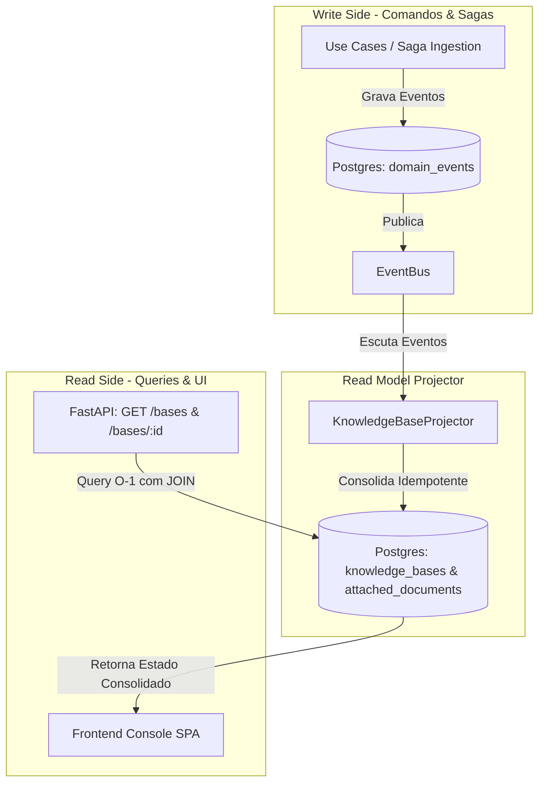

# Spec: CQRS Consolidated Read Model & Event-Driven Projections (Marco 1.12)

## Objective
Implementar e formalizar o padrão **CQRS (Command Query Responsibility Segregation)** no módulo `knowledge`, desacoplando as operações de escrita (Write Side orientado a Event Sourcing) das operações de leitura e apresentação (Read Side orientado a tabelas relacionais consolidadas e indexadas).

---

## Context & Motivation
1. **Write Side (Comandos & Sagas):**
   - O Agregado (`KnowledgeBaseAggregate`) é a autoridade transacional e de invariantes de negócio.
   - Sua hidratação deve sempre ocorrer via **Event Sourcing** (`load_from_history`) para assegurar concorrência otimista (`expected_version`) e integridade dos eventos imutáveis em `domain_events`.
2. **Read Side (Consultas HTTP & Frontend):**
   - Requisições de consulta (`GET /bases`, `GET /bases/{id}`, monitoramento de pipelines) exigem latência mínima ($O(1)$) e acesso a dados consolidados e desnormalizados (como o schema da ontologia vinculada e métricas de chunks/grafos de documentos).
   - O replay síncrono de eventos durante consultas HTTP cria acoplamento excessivo e degrada a performance com o crescimento do histórico de eventos.

---

## Architectural Design

---

## Contracts & Database Schema

### 1. Tabela `knowledge_bases`
- `id` (UUID, PK)
- `name` (VARCHAR, Not Null)
- `description` (TEXT, Nullable)
- `status` (VARCHAR, Not Null)
- `storage_partition` (VARCHAR, Not Null)
- `ontology_id` (UUID, FK -> `ontology_templates.id`, Nullable)
- `created_at` / `updated_at` (TIMESTAMP WITH TIME ZONE)

### 2. Tabela `attached_documents` (Migration `0006`)
- `id` (UUID, PK)
- `kb_id` (UUID, FK -> `knowledge_bases.id` ON DELETE CASCADE)
- `file_name` (VARCHAR, Not Null)
- `status` (VARCHAR, Not Null)
- `storage_path` (VARCHAR, Not Null)
- `enable_ocr` (BOOLEAN, Default FALSE)
- `ocr_instructions` (TEXT, Nullable)
- `total_parents` (INTEGER, Nullable)
- `total_children` (INTEGER, Nullable)
- `indexed_nodes_count` (INTEGER, Default 0)
- `indexed_edges_count` (INTEGER, Default 0)
- `error_step` (VARCHAR(100), Nullable)
- `error_message` (TEXT, Nullable)
- `created_at` / `updated_at` (TIMESTAMP WITH TIME ZONE)

---

## Lifecycle Events Handled by `KnowledgeBaseProjector`
1. `KnowledgeBaseCreatedEvent`: Realiza upsert da base e associa `ontology_id`.
2. `DocumentAttachedEvent`: Insere documento em status `PENDING_UPLOAD` com flags de OCR.
3. `DocumentStoredEvent`: Atualiza status para `UPLOADED` e define `storage_path`.
4. `DocumentParsedToMarkdownEvent`: Atualiza status para `PARSED`.
5. `DocumentChunkedEvent`: Atualiza status para `CHUNKED` e armazena contagens de `total_parents` e `total_children`.
6. `GraphExtractedFromDocumentEvent`: Atualiza status para `GRAPH_EXTRACTED`.
7. `DocumentKnowledgeIndexedEvent`: Atualiza status para `INDEXED` e armazena `indexed_nodes_count` e `indexed_edges_count`.
8. `DocumentProcessingFailedEvent`: Atualiza status para `FAILED` com `error_step` e `error_message`.

---

## Verificação e Critérios de Aceite
- [x] Migration Alembic `0006` com upgrades/downgrades idempotentes.
- [x] `KnowledgeBaseProjector` escutando os 8 eventos de domínio.
- [x] Repositório `PostgresKnowledgeBaseRepository` executando `LEFT JOIN` com ontologias e métricas de documentos.
- [x] Inicialização da aplicação com backfill/sincronização automática de projeções.
- [x] 100% de cobertura e tipagem estrita com Mypy e Ruff.
