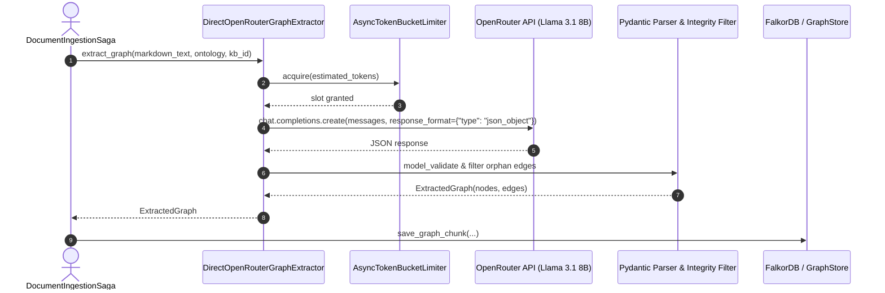

# Especificação Técnica: Extrator Ontológico Direto (Llama 3.1 8B + OpenRouter JSON)

## 1. Visão Geral e Motivação
Esta especificação define a arquitetura e os contratos do extrator ontológico de alta velocidade [`DirectOpenRouterGraphExtractor`](file:///Users/insider/personal/agentic-substrate/src/modules/knowledge/infrastructure/extractors/direct_openrouter_graph_extractor.py), projetado para substituir o extrator agêntico anterior e otimizar throughput, latência e custo operacional utilizando o modelo **`meta-llama/llama-3.1-8b-instruct`**.

---

## 2. Arquitetura e Fluxo de Execução

---

## 3. Contratos e Modelos de Domínio

### 3.1 Adapter `DirectOpenRouterGraphExtractor`
- **Localização:** `src/modules/knowledge/infrastructure/extractors/direct_openrouter_graph_extractor.py`
- **Protocolo Implementado:** `IGraphExtractor`
- **Parâmetros:**
  - `model_name: str` (Padrão: `"meta-llama/llama-3.1-8b-instruct"`)
  - `api_key: str | None`
  - `base_url: str` (Padrão: `"https://openrouter.ai/api/v1"`)
  - `rate_limiter: AsyncTokenBucketLimiter`
  - `max_concurrency: int` (Padrão: `50`)
  - `temperature: float` (Padrão: `0.0`)

### 3.2 Filtro de Integridade Referencial
Todo `source_id` e `target_id` declarado em `relations` deve pertencer ao conjunto de `id`s declarados em `entities`. Relações com nós não existentes no payload são descartadas de forma segura e não propagadas para o repositório de grafos.

---

## 4. Suíte de Avaliação de Modelos (`eval_graph_extractors.py`)

A suíte em [`scripts/eval_graph_extractors.py`](file:///Users/insider/personal/agentic-substrate/scripts/eval_graph_extractors.py) fornece um benchmark reproduzível com 3 cenários de complexidade:
1. **Baixa:** Entidades explícitas e relação unívoca.
2. **Média:** Múltiplas entidades, artigos de leis e competências legais.
3. **Alta:** Cenário denso multi-tribunal com competências cruzadas e recursos.

### Métricas de Avaliação:
- **Latência Total (ms)**
- **Integridade Referencial (%)**: $\frac{\text{Arestas com Nós Existentes}}{\text{Total de Arestas}} \times 100$
- **Aderência ao Schema (%)**: $\frac{\text{Nós Válidos} + \text{Relações Válidas}}{\text{Total de Elementos Extraídos}} \times 100$

---

## 5. Critérios de Aceite
- [x] O `DirectOpenRouterGraphExtractor` implementa `IGraphExtractor`.
- [x] Extração executa em sub-segundos para chunks de texto padrão.
- [x] 100% dos testes unitários em `test_direct_openrouter_graph_extractor.py` passam.
- [x] Aderência rigorosa à regra de *Single Class per File* e tipagem estrita no Mypy.
