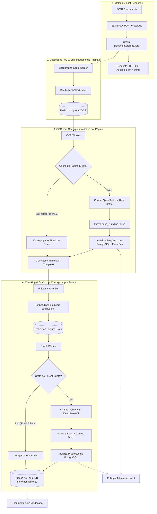

# SPEC-resilient-saga-reprocessing-and-job-queues: Reprocessamento Resiliente de Sagas com Filas de Jobs e Desperdício Zero de Tokens

## 1. Contexto e Motivação
Na ingestão de documentos extensos (ex: PDFs com 100 a 1.000+ páginas como a Constituição Federal de 1988), o pipeline GraphRAG executa operações computacionalmente intensivas e com alto custo de tokens:
1. **Passo 1 & 2 (OCR Multimodal):** Renderização e transcrição VLM de centenas de páginas via `qwen/qwen3-vl-30b-a3b-instruct`.
2. **Passo 3 (Embeddings Vetoriais):** Geração de vetores para milhares de *Child Chunks* via Gemini Embedding 2.
3. **Passo 4 (Extração de Grafo Ontológico):** Extração estruturada de entidades e relações em centenas de *Parent Chunks* via LLM (`google/gemma-4-31b-it` ou `deepseek/deepseek-v4-flash`).

### O Problema Atual
* **Volatilidade em Memória:** As etapas de OCR de páginas e extração de grafos são orquestradas via `asyncio.gather` dentro da memória do processo Python. Se o container reiniciar, sofrer queda de energia ou deploy na página 410 de 437, ou no chunk 1.800 de 2.000, **todo o progresso anterior é perdido**, gerando custo duplicado de tokens e tempo.
* **Falta de Checkpoints Atômicos:** Não há persistência intermediária por página ou por chunk.
* **Bloqueio do EventBus na Rota HTTP:** O dispatch síncrono in-process pode reter o worker da requisição `POST /documents` se não houver desacoplamento estrito.
* **Opacidade da UI:** O usuário visualiza apenas o status estático `PARSING` ou `GRAPH_EXTRACTION` por 10 a 20 minutos sem feedback de porcentagem ou página atual.

---

## 2. Objetivos e Critérios de Sucesso

### 2.1 Objetivos Centrais
1. **Checkpoints Granulares e Reprocessamento com Desperdício Zero de Tokens (*Zero-Token-Waste Resume*):**
   - Cada página de OCR transcrita é gravada imediatamente em disco (`storage_partition/ocr_cache/{doc_id}/page_{page_num}.md`).
   - Cada *Parent Chunk* com grafo extraído é salvo imediatamente (`storage_partition/graph_cache/{doc_id}/parent_{parent_id}.json`).
   - Se o processamento for interrompido ou reexecutado via `POST /bases/{kb_id}/documents/{doc_id}/reprocess`, o sistema identifica os checkpoints existentes e retoma **exatamente da primeira página/chunk pendente**, consumindo $0.00 de tokens nas partes já concluídas.
2. **Fila de Jobs Assíncrona no Redis (`RedisJobQueue`):**
   - Distribuição de tarefas de OCR de páginas e de extração de grafos através de uma fila persistente no Redis com controle de concorrência global e rate limiting centralizado.
3. **Desacoplamento Assíncrono Total da Saga:**
   - O endpoint de upload responde `202 Accepted` em `< 50ms`. A execução da Saga e seus passos rodam 100% desacoplados via background workers.
4. **Telemetria de Progresso em Tempo Real (CQRS):**
   - Novas colunas na tabela de projeção `attached_documents`: `current_step_progress` (ex: 142), `total_step_progress` (ex: 437) e `progress_message`.
   - O front-end exibe barra de progresso animada com porcentagem em tempo real (ex: `OCR: Página 142 de 437 (32%)`).

---

## 3. Arquitetura da Solução



---

## 4. Design Técnico Detalhado

### 4.1 Estrutura de Diretórios e Single Class per File (`AGENTS.md`)

```
src/
├── kernel/
│   └── infrastructure/
│       ├── redis_job_queue.py                      # Implementação de fila persistente no Redis
│       └── in_memory_job_queue.py                  # Implementação em memória para testes unitários
├── modules/
│   └── knowledge/
│       ├── domain/
│       │   ├── interfaces/
│       │   │   └── i_job_queue.py                  # Protocolo de Fila de Jobs assíncrona
│       │   ├── value_objects/
│       │   │   ├── job_task.py                     # VO de definição de Job atômico
│       │   │   ├── page_ocr_job_payload.py         # Payload específico de OCR de página
│       │   │   └── parent_graph_job_payload.py     # Payload específico de extração de grafo
│       │   └── events/
│       │       └── document_progress_updated_event.py # Evento de telemetria de progresso parcial
│       ├── infrastructure/
│       │   ├── adapters/
│       │   │   ├── page_checkpoint_storage.py      # Gerenciador de cache/checkpoints de páginas OCR
│       │   │   └── parent_graph_checkpoint_storage.py # Gerenciador de cache/checkpoints de grafos
│       │   ├── projections/
│       │   │   └── knowledge_base_projector.py     # Atualizado com projeção de telemetria
│       │   └── sagas/
│       │       └── document_ingestion_saga_coordinator.py # Saga com execução não-bloqueante e checkpoints
│       └── application/
│           └── use_cases/
│               └── reprocess_document/             # Caso de uso para retomar/reprocessar documento
│                   ├── reprocess_document_request.py
│                   ├── reprocess_document_response.py
│                   ├── reprocess_document_use_case.py
│                   └── __init__.py
└── api_gateway/
    └── controllers/
        └── knowledge_controller.py                 # Rota POST /bases/{kb_id}/documents/{doc_id}/reprocess
```

---

### 4.2 Esquema de Checkpoint no Storage Local

Para cada documento, são criadas pastas dedicadas de cache dentro da partição da KB:

```text
data/storage/
└── kb-{kb_id}/
    ├── raw/
    │   └── {doc_id}-{file_name}                     # PDF Original Bruto
    ├── toc/
    │   └── {doc_id}_toc.json                        # SyntheticDocumentToc serializado
    ├── ocr_cache/
    │   └── {doc_id}/
    │       ├── page_0001.md                         # Checkpoint Markdown da Página 1
    │       ├── page_0002.md                         # Checkpoint Markdown da Página 2
    │       └── page_0437.md                         # Checkpoint Markdown da Página 437
    ├── markdown/
    │   └── {doc_id}.md                              # Markdown final unificado e sanitizado
    ├── chunks/
    │   └── {doc_id}_chunks.json                     # Chunks serializados (evita re-chunking)
    └── graph_cache/
        └── {doc_id}/
            ├── parent_0001.json                     # Checkpoint do Grafo do Parent 1
            └── parent_0200.json                     # Checkpoint do Grafo do Parent 200
```

---

### 4.3 Mecanismo de Retomada Inteligente (*Resume Algorithm*)

#### Algoritmo do OCR de Páginas:
```python
async def parse_page_with_checkpoint(doc_id: UUID, page_num: int, total_pages: int, ...) -> str:
    # 1. Verifica se já existe cache em disco
    if await checkpoint_storage.has_page(doc_id, page_num):
        return await checkpoint_storage.get_page(doc_id, page_num)
    
    # 2. Se não existir, executa o VLM (consumo de tokens)
    page_md = await vlm_transcriber.transcribe(page_num, ...)
    
    # 3. Salva imediatamente em disco
    await checkpoint_storage.save_page(doc_id, page_num, page_md)
    
    # 4. Emite evento de progresso parcial
    await event_bus.publish([DocumentProgressUpdatedEvent(doc_id, step="OCR", current=page_num, total=total_pages)])
    return page_md
```

#### Algoritmo da Extração de Grafo:
```python
async def extract_parent_with_checkpoint(doc_id: UUID, parent_id: str, content: str, ontology: OntologySchema, ...) -> ExtractedGraph:
    # 1. Verifica se já existe cache do parent
    if await graph_checkpoint.has_parent(doc_id, parent_id):
        return await graph_checkpoint.get_parent(doc_id, parent_id)
    
    # 2. Se não existir, chama o LLM com o rate limiter
    graph = await extractor.extract_graph(markdown_text=content, ontology=ontology, kb_id=kb_id)
    
    # 3. Salva imediatamente em disco
    await graph_checkpoint.save_parent(doc_id, parent_id, graph)
    
    # 4. Grava menções no FalkorDB incrementalmente
    await graph_store.store_parent_mentions(kb_id, parent_id, graph)
    return graph
```

---

### 4.4 Migração de Banco de Dados: `migrations/0007_add_document_progress_telemetry.py`

Adição de colunas na tabela relacional `attached_documents`:

```sql
ALTER TABLE attached_documents
ADD COLUMN IF NOT EXISTS progress_step VARCHAR(50) DEFAULT NULL,
ADD COLUMN IF NOT EXISTS progress_current INTEGER DEFAULT 0,
ADD COLUMN IF NOT EXISTS progress_total INTEGER DEFAULT 0,
ADD COLUMN IF NOT EXISTS progress_percentage INTEGER DEFAULT 0,
ADD COLUMN IF NOT EXISTS progress_message TEXT DEFAULT NULL;
```

---

### 4.5 Alterações no Frontend Console

1. **Atualização da Tipagem (`frontend/src/api/types.ts`):**
   ```typescript
   export interface AttachedDocumentDTO {
     id: string;
     kb_id: string;
     file_name: string;
     status: DocumentStatus;
     progress_step?: string | null;
     progress_current?: number;
     progress_total?: number;
     progress_percentage?: number;
     progress_message?: string | null;
     // ...
   }
   ```
2. **Atualização do `PipelineStatusTracker.tsx`:**
   - Exibir barra de porcentagem dinâmica abaixo do card da etapa ativa quando `progress_total > 0`.
   - Botão **"Retomar / Reprocessar"** quando o documento estiver em status `FAILED` ou travado em `UPLOADED`.

---

## 5. Estratégia de Testes (TDD)

1. **Unit Tests:**
   - `test_page_checkpoint_storage.py`: Valida criação, leitura e detecção de páginas em cache.
   - `test_parent_graph_checkpoint_storage.py`: Valida serialização e recuperação de nós/arestas Pydantic.
   - `test_in_memory_job_queue.py` & `test_redis_job_queue.py`: Valida enfileiramento, consumo com semáforo e retries.
   - `test_reprocess_document_use_case.py`: Valida re-disparo da saga a partir dos checkpoints existentes.
2. **Integration Tests:**
   - `test_saga_resume_efficiency.py`: Simula falha/interrupção na página 5 de 10. Ao reprocessar, valida que as páginas 1 a 5 **não chamam o mock do OpenRouter/LLM**, consumindo 0 chamadas.
   - `test_projector_progress_telemetry.py`: Valida atualização das colunas de progresso em tempo real.
3. **Quality Gates:**
   - `make pre-commit`: Mypy strict sem `Any` implícito, Ruff format/lint 100%, 0 erros de regressão.

---

## 6. Limites e Regras Inegociáveis (Boundaries)

- **Sempre Fazer:**
  - Salvar o arquivo de checkpoint em disco antes de emitir a telemetria de sucesso da página/chunk.
  - Usar caminhos atômicos e formatados com padding numérico (`page_0001.md`, `page_0002.md`) para ordenação determinística.
  - Preservar retrocompatibilidade com documentos puramente textuais (.txt, .md).
- **Perguntar Primeiro:**
  - Alterações nos parâmetros de concorrência global da fila Redis.
- **Nunca Fazer:**
  - Descartar arquivos de cache de OCR/Grafo sem comando explícito de limpeza total (*hard reset*).
  - Bloquear o loop principal do FastAPI com operações síncronas de I/O.

---

## 7. Critérios de Aceite e Verificação

- [ ] Upload de PDF de 400+ páginas responde `202 Accepted` em `< 50ms`.
- [ ] Durante a fase de OCR, cada página é salva em `ocr_cache/{doc_id}/page_{N}.md`.
- [ ] Durante a fase de Grafo, cada parent chunk é salvo em `graph_cache/{doc_id}/parent_{N}.json`.
- [ ] Se o container reiniciar ou o usuário clicar em "Retomar", as páginas e chunks já existentes em cache são carregados instantaneamente com $0 de custo de API.
- [ ] A API disponibiliza a rota `POST /api/v1/knowledge/bases/{kb_id}/documents/{doc_id}/reprocess`.
- [ ] A tabela `attached_documents` e o frontend refletem o progresso granular (`progress_current / progress_total`).
- [ ] `make pre-commit` passa com 100% de sucesso.
