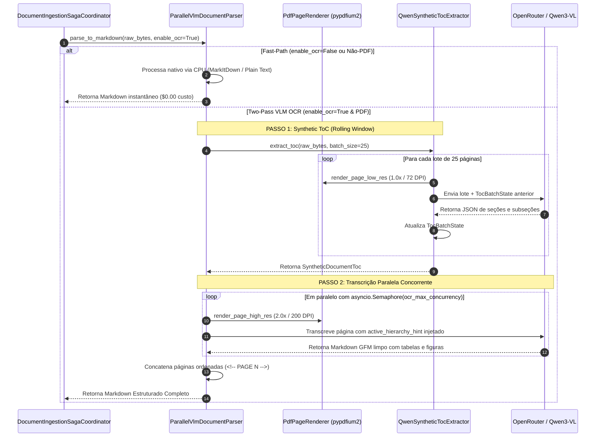

# SPEC: Stateful Synthetic ToC & Resilient Parallel VLM OCR

## 1. Objetivo e Visão Geral
Prover um motor de extração e OCR multimodal estruturado de altíssima performance para documentos PDF (e extensões multimodais) no módulo `knowledge`. A arquitetura substitui o parsing sequencial por um padrão **Two-Pass**:
1. **Passo 1 (Descoberta Estrutural - Synthetic ToC):** Identifica a árvore hierárquica determinística do documento (`#`, `##`, `###`, `####`) mesmo em arquivos sem página de sumário/índice, através de fatiamento em lotes encadeados de 20-25 páginas em baixa resolução (1.0x / ~72 DPI) com passagem de estado ativo (`TocBatchState`).
2. **Passo 2 (Transcrição Paralela Concorrente):** Renderiza páginas em alta resolução (2.0x / ~200 DPI) e transcreve simultaneamente com semáforo de concorrência (`asyncio.Semaphore`), injeção determinística de hierarquia por página (`active_hierarchy_hint`) e controle de taxa de rede (`RateLimitedAsyncTransport` com backoff exponencial contra `HTTP 429`).

---

## 2. Diagrama de Sequência Arquitetural



---

## 3. Contratos e Modelos de Domínio

### 3.1 `HierarchicalTocItem` (Value Object)
```python
class HierarchicalTocItem(BaseModel):
    type: Literal["document_title", "section", "subsection", "sub_subsection"]
    markdown_level: Literal["#", "##", "###", "####"]
    title: str
    page: int
    parent_section: str | None = None
```

### 3.2 `TocBatchState` (Value Object)
```python
class TocBatchState(BaseModel):
    active_section: str | None = None
    active_subsection: str | None = None
    active_markdown_level: str | None = None
    last_page_processed: int = 0
```

### 3.3 `SyntheticDocumentToc` (Entidade)
* `items: list[HierarchicalTocItem]`
* `get_active_hierarchy_for_page(page: int) -> str`
* `to_markdown_toc() -> str`

### 3.4 `ISyntheticTocExtractor` (Protocolo)
```python
class ISyntheticTocExtractor(Protocol):
    async def extract_toc(
        self,
        raw_bytes: bytes,
        batch_size: int = 25,
        progress_callback: (Callable[[int, int, str], Coroutine[Any, Any, None]] | None) = None,
        doc_id: UUID | None = None,
        kb_partition: str | None = None,
    ) -> SyntheticDocumentToc: ...
```

### 3.5 `TocCheckpointStorage` (Adaptador de Checkpoint de ToC)
* Persistência de lotes intermediários: `{storage_partition}/toc_cache/{doc_id}/batch_{batch_num:04d}.json`
* Persistência de ToC consolidado: `{storage_partition}/toc_cache/{doc_id}/toc.json`
* Suporte a retomada a custo **0 de tokens** no passo de ToC.

---

## 4. Configurações de Governança e Resiliência

# Concorrência e Batching
OCR_VISION_MODEL_NAME=qwen/qwen3-vl-32b-instruct
OCR_MAX_CONCURRENCY=5
OCR_TOC_BATCH_SIZE=25
OCR_LOW_RES_SCALE=1.0
OCR_HIGH_RES_SCALE=2.0

# Rate Limiting, Throughput Routing & Backoff
OPENROUTER_MAX_RPM=300
OPENROUTER_MAX_TPM=1000000
OCR_MAX_RETRIES_429=5
OCR_PROVIDER_SORT=throughput
OCR_REASONING_EFFORT=none

---

## 5. Resiliência a Falhas, Retomada e Telemetria Monotônica (Marco 1.16)

1. **Fast-Path OCR Cache Hit:** Se 100% das páginas ($1..total\_pages$) já existirem em `PageCheckpointStorage`, o parser ignora o `extract_toc` e monta o Markdown instantaneamente do cache a custo **0 de tokens**.
2. **Resumption Granular de Lotes do ToC:** Se a saga reiniciar durante o ToC, cada lote previamente gravado em `TocCheckpointStorage` é recarregado do disco sem chamadas ao OpenRouter.
3. **Worker Pool e Telemetria Monotônica:** O OCR consome tarefas via `asyncio.Queue` com $W = \text{max\_concurrency}$ workers, mantendo uso de RAM $O(\text{concurrency})$ e emitindo contador estritamente monotônico de páginas concluídas ($1 \rightarrow 2 \rightarrow 3 \dots N$).
4. **Thread-Safety no PDFium:** Mutex de thread (`threading.Lock`) no `PdfPageRenderer` isola chamadas nativas em C do PDFium em ambientes multithread.
5. **Proteção SQL no Projector:** Query com `GREATEST` no `KnowledgeBaseProjector` impede qualquer regressão visual de percentual no banco.

---

## 6. Critérios de Sucesso e Validação
- [x] **Zero Erros de Tipagem:** `mypy` strict mode passando em 100% dos arquivos.
- [x] **Single Class per File:** Nenhuma classe agrupada em mono-arquivo.
- [x] **Paralelismo Seguro:** Respeito rigoroso a `OCR_MAX_CONCURRENCY` sem estourar limites de conexão.
- [x] **Continuidade de Hierarquia:** Injeção determinística de `#`, `##`, `###` e tags de figuras `> **[Figura X: ...]**`.
- [x] **Zero-Token ToC & OCR Resume:** Checkpoints granulares para lotes de ToC e páginas individuais de OCR.
- [x] **Telemetria Monotônica:** Barra de progresso suave e estritamente crescente no frontend.
